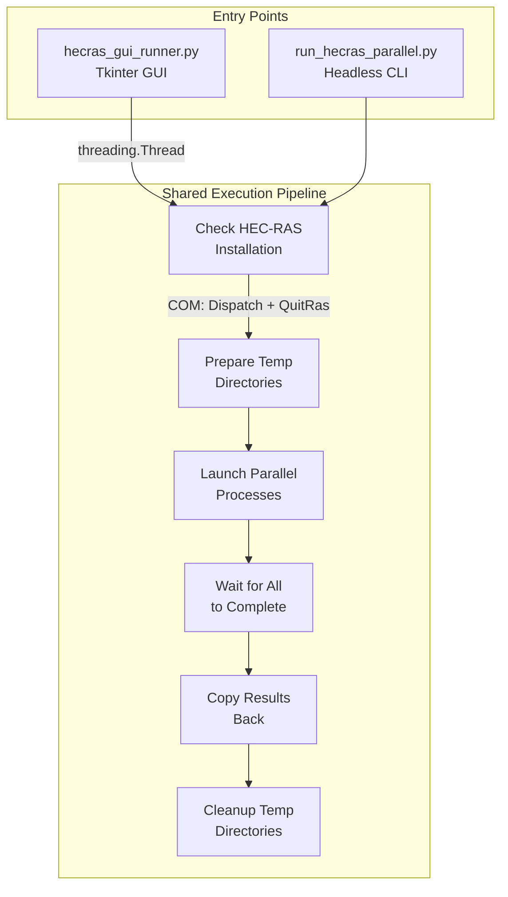
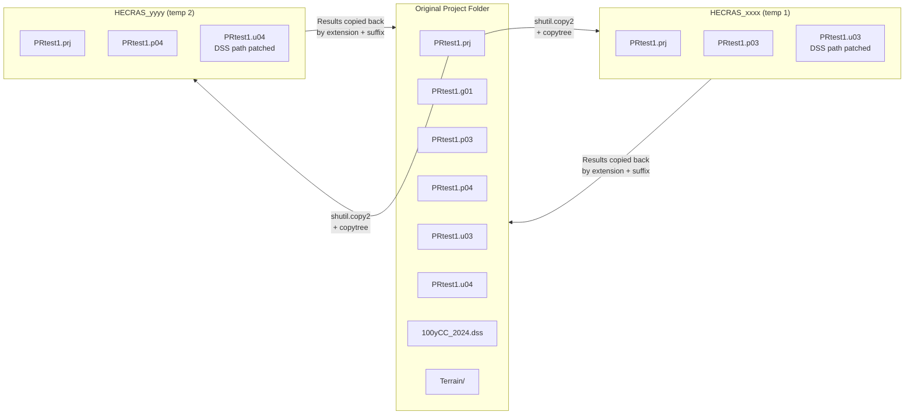
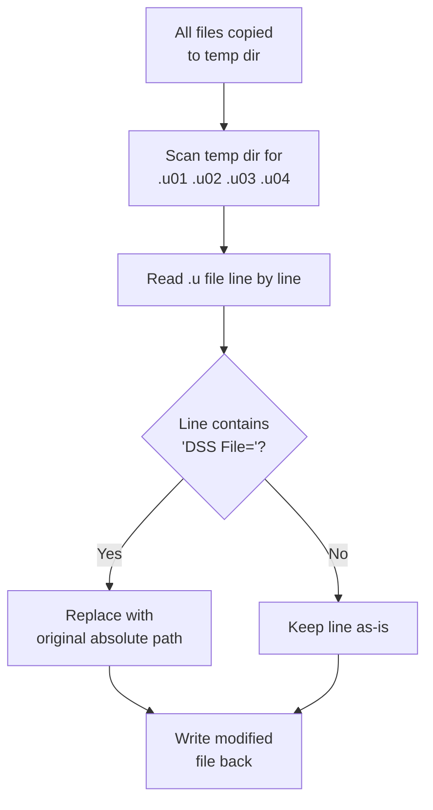
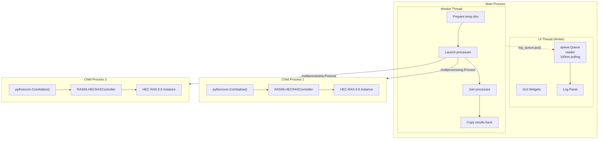
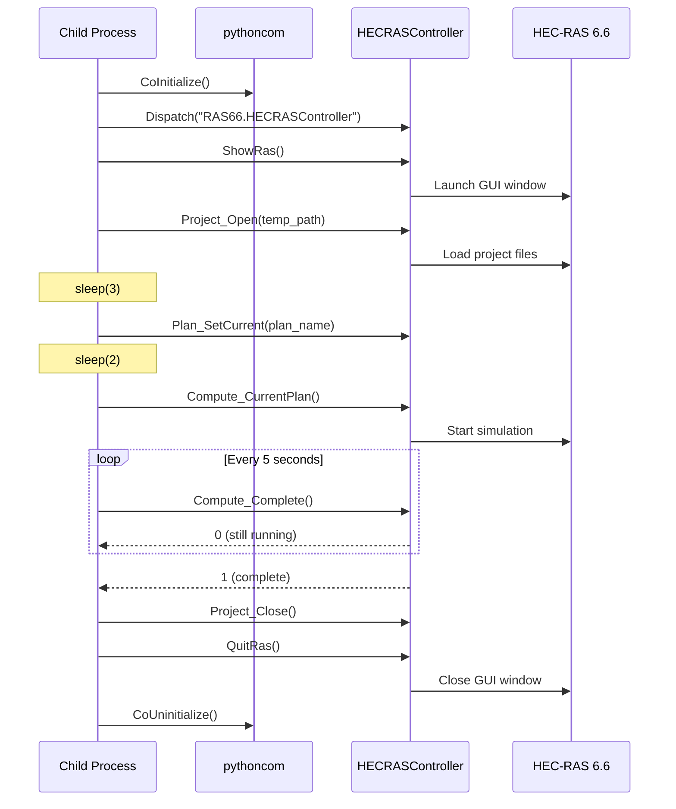
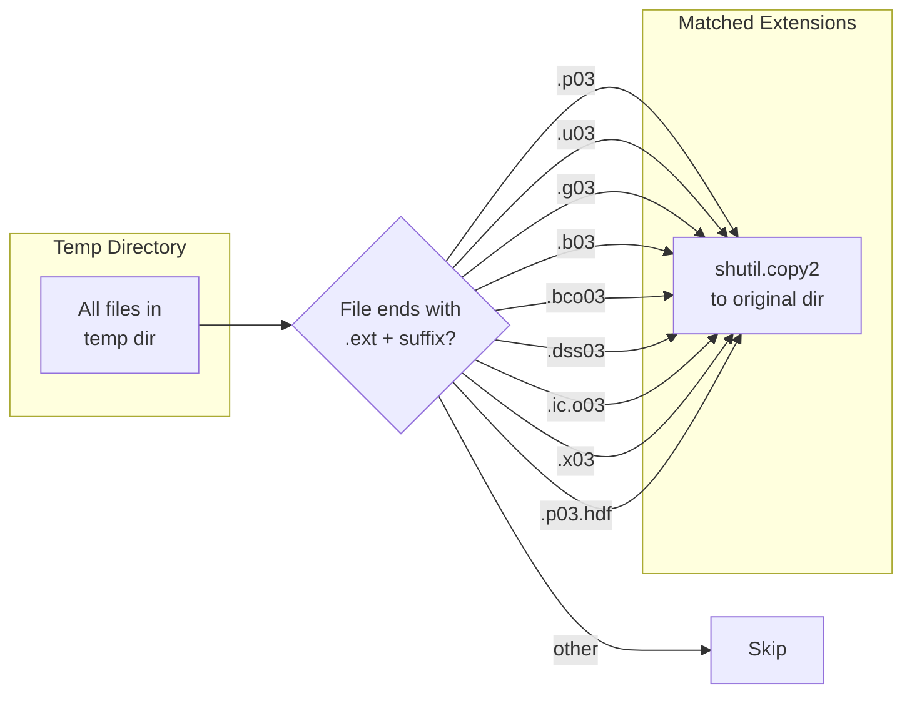
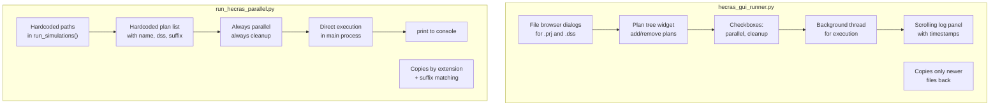
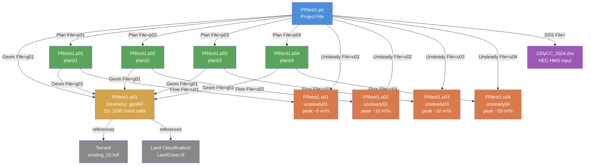

# arx-hecras — Architecture

How the HEC-RAS Parallel Runner works, from user input to simulation results.

## 1. Overall System Flow

The tool has two entry points (GUI and CLI) that share the same execution pipeline.

## 2. Temp Directory Isolation

HEC-RAS locks project files during computation. Each plan runs against its own copy in a temp directory, preventing file access conflicts.

## 3. DSS Path Patching

When a plan references an external DSS file (e.g. HEC-HMS hydrograph input), the path in `.u##` files must point back to the original location since the temp directory is elsewhere on disk.

## 4. Process Architecture

The GUI runs simulation logic in a background thread. Each plan gets its own child process with an independent COM connection to a separate HEC-RAS instance.

## 5. COM Automation Sequence

Each child process follows this sequence to drive a HEC-RAS instance. The entire lifecycle happens inside a single `multiprocessing.Process`.

## 6. Result Harvesting

After all processes complete, result files are copied from each temp directory back to the original project folder, matched by extension and plan suffix number.

## 7. GUI vs CLI Differences

## 8. HEC-RAS Project File Structure

How the test project components reference each other.

